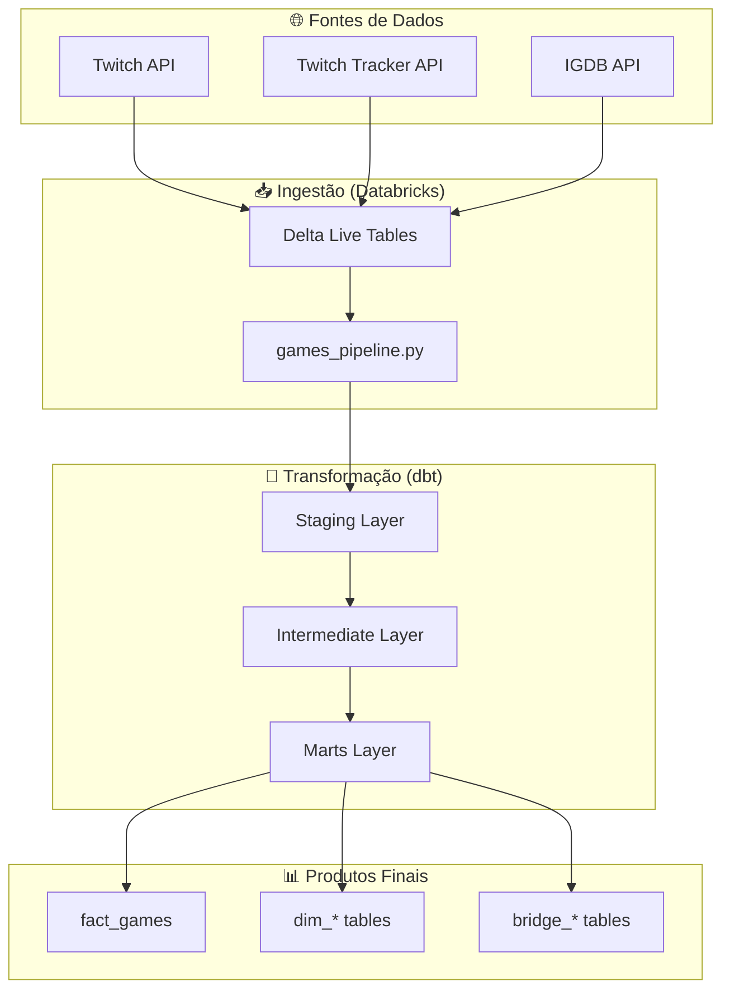

# 🎮 Games Analytics - Complete Data Pipeline

[](https://www.getdbt.com/)
[](https://databricks.com/)
[](https://python.org/)

> Uma pipeline completa de dados de jogos que combina APIs do Twitch, Twitch Tracker e IGDB para análises abrangentes do mercado de games.

## 📋 Índice

- [🎯 Visão Geral](#-visão-geral)
- [🏗️ Arquitetura](#️-arquitetura)
- [📁 Estrutura do Projeto](#-estrutura-do-projeto)
- [🚀 Setup e Instalação](#-setup-e-instalação)
- [💻 Uso](#-uso)
- [📊 Modelos de Dados](#-modelos-de-dados)
- [🔄 Workflow Git](#-workflow-git)
- [📋 Padrões de Código](#-padrões-de-código)
- [🧪 Testes](#-testes)
- [📚 Documentação](#-documentação)
- [🤝 Contribuição](#-contribuição)

## 🎯 Visão Geral

Este projeto implementa uma pipeline de dados completa para análise do mercado de jogos, integrando múltiplas fontes:

- **🎮 Twitch API**: Top 100 jogos mais assistidos
- **📊 Twitch Tracker**: Métricas detalhadas de viewership
- **🎯 IGDB API**: Base de dados completa de jogos

### Funcionalidades Principais

- ✅ Ingestão automatizada de dados via Databricks bundles
- ✅ Transformação e modelagem dimensional com dbt
- ✅ Testes de qualidade de dados automatizados
- ✅ Documentação completa e lineage tracking
- ✅ Modelagem star schema com fact e dimension tables

## 🏗️ Arquitetura



## 📁 Estrutura do Projeto

```
games_analytics/
├── 📦 ingestion_bundle/          # Databricks bundle para ingestão
│   ├── src/
│   │   ├── games_pipeline.py     # Pipeline principal de ingestão
│   │   └── games_analytics/      # APIs clients
│   ├── resources/
│   └── databricks.yml
├── 🔄 transformation_dbt/        # Projeto dbt para transformações
│   ├── models/
│   │   ├── staging/              # Padronização inicial
│   │   ├── intermediate/         # Transformações intermediárias
│   │   └── marts/                # Modelos finais (fact/dim/bridge)
│   ├── tests/
│   └── dbt_project.yml
└── 📋 README.md                  # Este arquivo
```

## 🚀 Setup e Instalação

### Pré-requisitos

- 🔧 **Databricks Workspace** com Unity Catalog
- 🗝️ **Credenciais de API**:
  - Twitch Client ID e Client Secret
  - IGDB usa as mesmas credenciais Twitch OAuth2
- 🛠️ **Databricks CLI** instalado
- 🐍 **Python 3.9+**
- 📦 **dbt-databricks**

### 1. Configuração do Ambiente

```bash
# Instalar dependências
pip install databricks-cli dbt-databricks

# Configurar autenticação Databricks
databricks configure
```

### 2. Configuração dos Secrets

```bash
# Criar scope de secrets
databricks secrets create-scope twitch

# Adicionar credenciais
databricks secrets put-secret twitch client_id
databricks secrets put-secret twitch client_secret
```

### 3. Deploy da Ingestão

```bash
cd ingestion_bundle
databricks bundle deploy
```

### 4. Configuração do dbt

```bash
cd transformation_dbt
dbt deps
dbt debug
```

## 💻 Uso

### Executar Pipeline Completa

```bash
# 1. Ingestão de dados
cd ingestion_bundle
databricks bundle run

# 2. Transformações dbt
cd ../transformation_dbt
dbt build
```

### Comandos dbt Úteis

```bash
# Executar apenas staging
dbt run --select staging

# Executar testes
dbt test

# Gerar documentação
dbt docs generate
dbt docs serve
```

## 📊 Modelos de Dados

### 🏗️ Staging Layer
Padronização inicial dos dados brutos:
- `stg__igdb`: Dados dos jogos IGDB
- `stg__twitch`: Top jogos Twitch
- `stg__twitch_tracker`: Métricas de viewership
- `stg__companies`: Empresas desenvolvedoras/publishers
- `stg__genres`, `stg__platforms`, etc.

### 🔄 Intermediate Layer
Transformações e enriquecimentos:
- `int_twitch__enriched`: Twitch + Twitch Tracker combinados
- `int_games__companies`: Jogos com empresas associadas
- `int_languages__distinct`: Idiomas únicos consolidados

### 🎯 Marts Layer (Star Schema)

#### Fact Table
- **`fact_games`**: Tabela fato central com métricas agregadas

#### Dimension Tables
- `dim_games`: Informações básicas dos jogos
- `dim_companies`: Empresas (desenvolvedoras/publishers)
- `dim_genres`: Gêneros de jogos
- `dim_platforms`: Plataformas
- `dim_themes`: Temas
- `dim_languages`: Idiomas
- `dim_keywords`: Palavras-chave
- `dim_game_modes`: Modos de jogo

#### Bridge Tables
- `bridge_game_companies`: Relacionamento jogos ↔ empresas
- `bridge_game_genres`: Relacionamento jogos ↔ gêneros
- `bridge_game_platforms`: Relacionamento jogos ↔ plataformas
- E outros relacionamentos many-to-many...

## 🔄 Workflow Git

### Branches

- `main`: Produção
- `develop`: Desenvolvimento
- `feature/*`: Novas funcionalidades

### Processo

```bash
# 1. Criar feature branch
git checkout -b feature/nova-funcionalidade

# 2. Desenvolver e testar
git add .
git commit -m "feat: adicionar nova funcionalidade"

# 3. Push e PR
git push origin feature/nova-funcionalidade
# Criar Pull Request para develop

# 4. Merge para main após aprovação
```

## 📋 Padrões de Código

### dbt Code Style (Padrão Indicium)

- ✅ **Vírgulas sempre na frente**
- ✅ **`with` em uma linha, CTE em nova linha**
- ✅ **Limite de 100 caracteres por linha**
- ✅ **CTEs não precisam ser renomeadas em joins**
- ✅ **`order by` multi-linha com vírgulas separadas**
- ✅ **`case when` com indentação em `then`**
- ✅ **`from` sempre em segunda linha**

### Exemplo:

```sql
with 
    games_base as (
        select 
            igdb_id
            , game_name
            , case 
                when total_rating > 80 
                    then 'Excelente'
                when total_rating > 60 
                    then 'Bom'
                else 'Regular'
            end as rating_category
        from {{ ref('stg__igdb') }}
    )

select *
from games_base
order by 
    total_rating desc
    , game_name
```

## 🧪 Testes

### Testes de Qualidade
- ✅ **not_null**: Campos obrigatórios
- ✅ **unique**: Chaves primárias
- ✅ **relationships**: Integridade referencial
- ✅ **accepted_values**: Valores válidos
- ✅ **accepted_range**: Ranges numéricos

### Executar Testes

```bash
# Todos os testes
dbt test

# Testes específicos
dbt test --select staging
dbt test --select fact_games
```

## 📚 Documentação

### Arquivos YAML
- ✅ Todos os modelos têm `.yml` correspondente
- ✅ Todas as colunas documentadas
- ✅ Testes de qualidade definidos
- ✅ Descrições detalhadas

### Gerar Docs

```bash
dbt docs generate
dbt docs serve
```

## 🤝 Contribuição

1. 🍴 Fork o projeto
2. 🌿 Crie uma feature branch
3. ✍️ Faça suas alterações
4. 🧪 Execute os testes
5. 📬 Submeta um Pull Request

### Guidelines

- Siga os padrões de código estabelecidos
- Adicione testes para novas funcionalidades
- Documente todas as mudanças nos YAMLs
- Mantenha o README atualizado

---

📧 **Contato**: [seu-email@exemplo.com]  
📂 **Repositório**: [github.com/usuario/games-analytics]