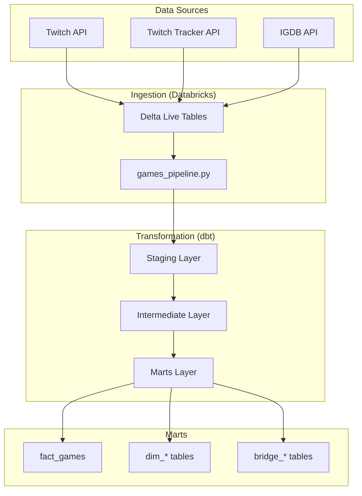

# Games Analytics - Complete Data Pipeline


A complete games data pipeline that combines Twitch, Twitch Tracker and IGDB APIs for comprehensive gaming market analytics.

## Overview

This project implements a complete data pipeline for gaming market analysis, integrating multiple sources:

- **Twitch API**: Top 100 most watched games
- **Twitch Tracker**: Detailed viewership metrics
- **IGDB API**: Complete games database

### Key Features

- Automated data ingestion via Databricks bundles
- Dimensional modeling and transformations with dbt
- Automated data quality testing
- Complete documentation and lineage tracking
- Star schema modeling with fact and dimension tables

## Architecture



## Project Structure

```
games_analytics/
├── ingestion_bundle/             # Databricks bundle for ingestion
│   ├── src/
│   │   ├── games_pipeline.py     # Main ingestion pipeline
│   │   └── games_analytics/      # API clients
│   ├── resources/
│   └── databricks.yml
├── transformation_dbt/           # dbt project for transformations
│   ├── models/
│   │   ├── staging/              # Initial standardization
│   │   ├── intermediate/         # Intermediate transformations
│   │   └── marts/                # Final models (fact/dim/bridge)
│   ├── tests/
│   └── dbt_project.yml
└── README.md                     # This file
```

## Setup and Installation

### Prerequisites

- **Databricks Workspace** with Unity Catalog
- **API Credentials**:
  - Twitch Client ID and Client Secret
  - IGDB uses the same Twitch OAuth2 credentials
- **Databricks CLI** installed
- **Python 3.9+**
- **dbt-databricks**

### 1. Environment Setup

```bash
# Install dependencies
pip install databricks-cli dbt-databricks

# Configure Databricks authentication
databricks configure
```

### 2. Secrets Configuration

```bash
# Create secrets scope
databricks secrets create-scope twitch

# Add credentials
databricks secrets put-secret twitch client_id
databricks secrets put-secret twitch client_secret
```

### 3. Deploy Ingestion

```bash
cd ingestion_bundle
databricks bundle deploy
```

### 4. dbt Configuration

```bash
cd transformation_dbt
dbt deps
dbt debug
```

## Usage

### Run Complete Pipeline

```bash
# 1. Data ingestion
cd ingestion_bundle
databricks bundle run

# 2. dbt transformations
cd ../transformation_dbt
dbt build
```

### Useful dbt Commands

```bash
# Run only staging
dbt run --select staging

# Run tests
dbt test

# Generate documentation
dbt docs generate
dbt docs serve
```
## Git Workflow

### Branches

- `main`: Production
- `develop`: Development
- `feature/*`: New features

### Process

```bash
# 1. Create feature branch
git checkout -b feature/new-feature

# 2. Develop and test
git add .
git commit -m "feat: add new feature"

# 3. Push and PR
git push origin feature/new-feature
# Create Pull Request to develop

# 4. Merge to main after approval
```

## Testing

### Quality Tests
- **not_null**: Required fields
- **unique**: Primary keys
- **relationships**: Referential integrity
- **accepted_values**: Valid values
- **accepted_range**: Numeric ranges

### Run Tests

```bash
# All tests
dbt test

# Specific tests
dbt test --select staging
dbt test --select fact_games
```

## Documentation

### YAML Files
- All models have corresponding `.yml` files
- All columns documented
- Quality tests defined
- Detailed descriptions

### Generate Docs

```bash
dbt docs generate
dbt docs serve
```
