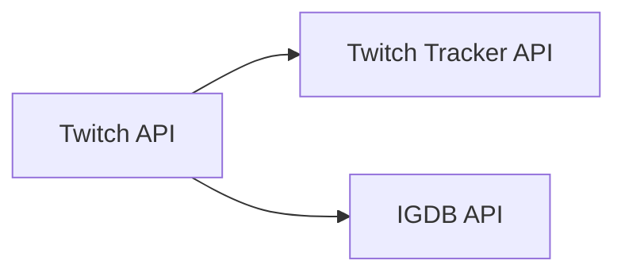

# Games Analytics - Ingestion Bundle

A Databricks bundle for ingesting gaming data from multiple APIs including Twitch, Twitch Tracker, and IGDB.

## Overview

This ingestion pipeline provides data collection and processing for:
- **Twitch API**: Top games
- **Twitch Tracker API**: Analytics data including average viewers, hours watched, and rankings
- **IGDB API**: Comprehensive game database with detailed metadata

The pipeline uses Delta Live Tables (DLT) for automated data quality, lineage tracking, and incremental processing.

## Architecture



## Prerequisites

1. **Databricks Workspace**: Unity Catalog enabled
2. **API Credentials**:
   - Twitch Client ID and Client Secret
   - IGDB uses Twitch OAuth (same credentials)
3. **Databricks CLI**: [Installation Guide](https://docs.databricks.com/dev-tools/cli/databricks-cli.html)

## Setup

### 1. Install Dependencies
```bash
# Install Databricks CLI
pip install databricks-cli
```

### 2. Configure databricks authentication
```bash
databricks configure
```

### 3. Set Up API secrets
Create secrets in Databricks for API authentication:
```bash
# Create secret scope
databricks secrets create-scope twitch

# Add Twitch credentials
databricks secrets put-secret twitch client_id
databricks secrets put-secret twitch client_secret
```

### 4. Deploy the Bundle
```bash
databricks bundle deploy 
```

## Usage

### Running the Pipeline
```bash
# Run the complete ingestion pipeline
databricks bundle run

# Run specific jobs
databricks jobs run-now --job-id <job-id>
```

### Monitoring
- **DLT Pipeline**: Monitor in Databricks UI
- **Data Quality**: Built-in DLT expectations for data validation
- **Lineage**: Automatic tracking of data dependencies and transformations

## Data Sources

### Twitch API
- **Endpoint**: `/helix/games/top`
- **Authentication**: Twitch OAuth2 tokens
- **Data**: Game IDs, names, box art URLs, IGDB IDs

### Twitch Tracker API  
- **Data**: Average viewers, channels, rankings, hours watched
- **Dependency**: Uses game IDs from Twitch API

### IGDB API
- **Endpoint**: `/v4/games`
- **Data**: Detailed game metadata (ratings, genres, platforms, release dates)
- **Authentication**: Twitch OAuth2 tokens
- **Dependency**: Uses IGDB IDs from Twitch API
